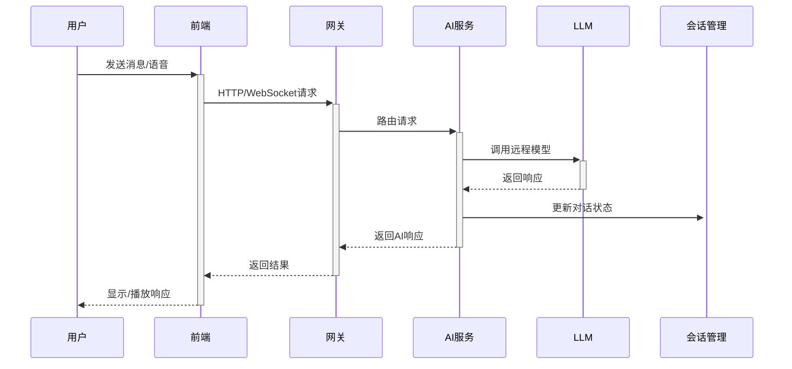
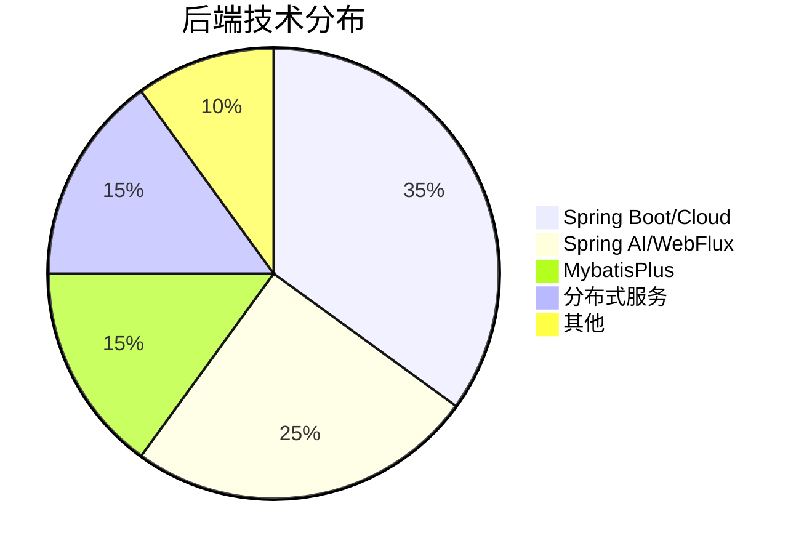

# 
YH - 智能短视频平台

## 🌟 项目概述
**YH** 是一款基于 **微服务架构** 的智能短视频平台，融合短视频创作、社交互动、直播娱乐、商城购物等功能于一体。项目采用前沿技术栈实现高并发、高可用性，并通过AI技术赋能，致力于打造沉浸式短视频体验。

---

## 🚀 核心功能模块

### 🎬 智能视频交互
| 功能              | 技术实现                  | 特点                     |
|-------------------|-----------------------|--------------------------|
| 手势刷视频        | OpenCV + MediaPipe    | 手势识别控制视频切换     |
| 智能视频推荐      | 基于内容推荐算法 + 用户行为分析     | 个性化内容推送           |
| 视频查重系统      | HSV特征提取 + Milvus向量数据库 | 高效版权保护             |

### 💬 AI对话系统

### 🔴 直播生态系统
- **实时视频流**：WebRTC + SRS服务器
- **直播聊天室**：STOMP协议 + RabbitMQ消息代理
- **直播电商**：商品实时上架 + 购物车集成
- **虚拟礼物系统**：动画特效 + 即时到账

### 🛒 智能商城模块
- **AI智能客服**：意图识别 + 状态机上下文管理
- **支付系统**：支付宝沙箱支付集成
- **商品推荐**：基于用户画像的精准推荐
- **订单管理**：全流程订单追踪系统

## 🎯 技术架构

### 🛠 后端技术栈

| 组件              | 技术选型                          | 用途                     |
|-------------------|----------------------------------|--------------------------|
| 核心框架          | Spring Boot 3.x + Spring Cloud   | 微服务基础架构           |
| AI集成            | Spring AI + WebFlux             | 异步AI服务调用           |
| ORM框架           | MybatisPlus                     | 数据库操作               |
| API网关           | Spring Cloud Gateway            | 请求路由与过滤           |

### 🌐 前端技术栈
| 技术             | 用途         |
|----------------|------------|
| Vue3           | 核心框架       |
| ElementPlus    | UI组件库      |
| TD Chat for AI | AI Chat组件库 |
| Web Speech API | 语音识别与合成    |
| WebRTC         | 实时音视频通信    |

### 📦 中间件与基础设施
| 类型           | 技术选型                     | 用途                             |
|----------------|-----------------------------|----------------------------------|
| 数据库         | MySQL + Redis               | 结构化数据存储 + 缓存            |
| 搜索引擎       | ElasticSearch               | 内容检索与推荐                   |
| 向量数据库     | Milvus                      | 视频特征存储与相似度检索         |
| 消息队列       | RabbitMQ                    | 系统解耦与异步通信               |
| 服务发现       | Nacos                       | 服务注册与配置中心               |
| 流媒体服务器   | SRS(Simple Realtime Server) | 实时视频流分发                   |
| 文件存储       | MT(自研文件存储服务)         | 海量媒体资源存储                 |
| 熔断降级       | Sentinel                    | 系统稳定性保障                   |

## 🔮 项目亮点

### ✨ 技术创新点
1. **多模态交互**  
   `手势控制` + `语音交互` + `文本聊天` 的融合体验

2. **高性能视频处理**
  - HSV特征提取算法优化
  - Milvus亿级向量相似度检索
  - 分布式视频转码处理

3. **实时直播生态系统**  
   WebRTC + SRS服务器保障低延迟直播体验

### 🏆 架构优势
- **弹性扩展**：微服务架构支持按需扩容
- **异步非阻塞**：WebFlux实现高并发处理

## 🌈 未来规划
1. 增加**AI长期记忆**功能
2. 集成**TinyVue**实现LLM控制Web组件
3. 支持**多语言**国际化版本

## 📷 前端页面展示

  <!-- 首页 -->
  

  <!-- 直播 -->
  

  <!-- 创作者平台 -->
  

  <!-- AI文字聊天 -->
  

  <!-- AI语音聊天 -->
  

  <!-- 商品详情 -->
    

---
- 前端：https://gitee.com/YXXHYH/yh-fe
- 管理后台：https://gitee.com/YXXHYH/yh-admin-fe